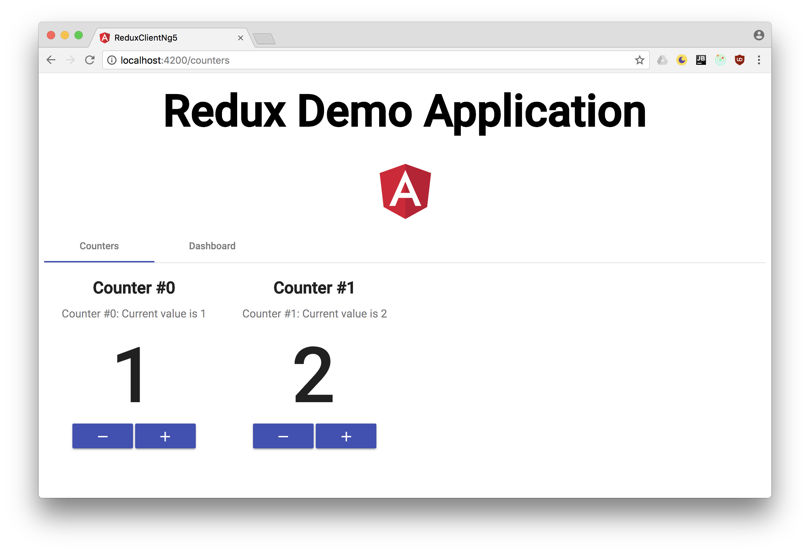

# Angular Redux Client

This is a single-page applicaton written in TypeScript using Angular 5. It
retrieves counters from a REST service and displays them. You can increase and
decrease each counter's value. A second page displays a little dashboard that
does some analytics on your counters and their values.

## Purpose

I wanted to learn more about the Redux architectural pattern to solve common
problems like the same data being used in multiple components. Changes in one
component would not update the other component's data, so one would either have
to deal with this chaos or notify the other components about change with e. g.
events. This is complicated, error-prone and very ugly. Redux perfectly solves
this problem. So I wrote this app together with the server side which you can
find [here](https://github.com/MichaelKaaden/redux-server).

The app utilizes [angular-redux](https://github.com/angular-redux/store). For
asynchronous action like loading and saving counters from and to the REST
service, it uses the
[Action Creator Service Pattern](https://github.com/angular-redux/store/blob/master/articles/action-creator-service.md).

By the way, the app is translated in English and German. To start the app using
English, use `yarn run serve-aot-en`. For German, use `yarn run serve-aot-de`.
To add more translated strings, use `yarn run extract-i18n`.

## Development server

Run `ng serve` for a dev server. Navigate to `http://localhost:4200/`. The app
will automatically reload if you change any of the source files.

To get more help on the Angular CLI use `ng help` or go check out the
[Angular CLI README](https://github.com/angular/angular-cli/blob/master/README.md).
